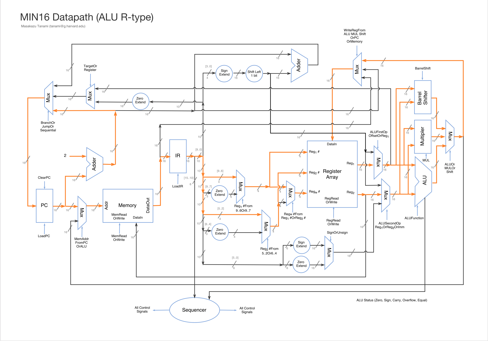
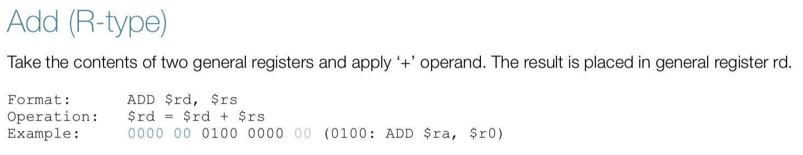
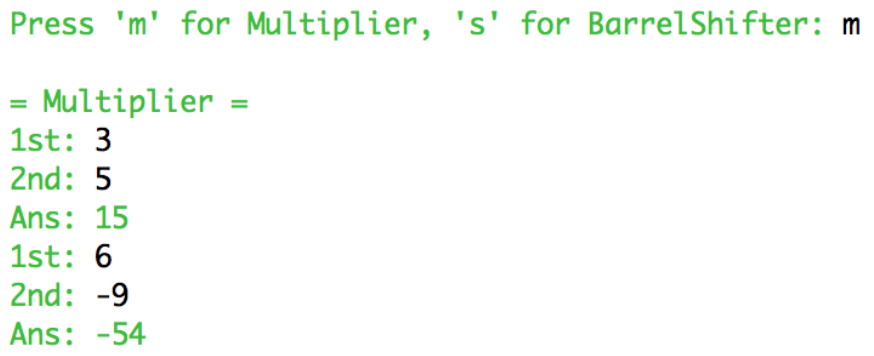
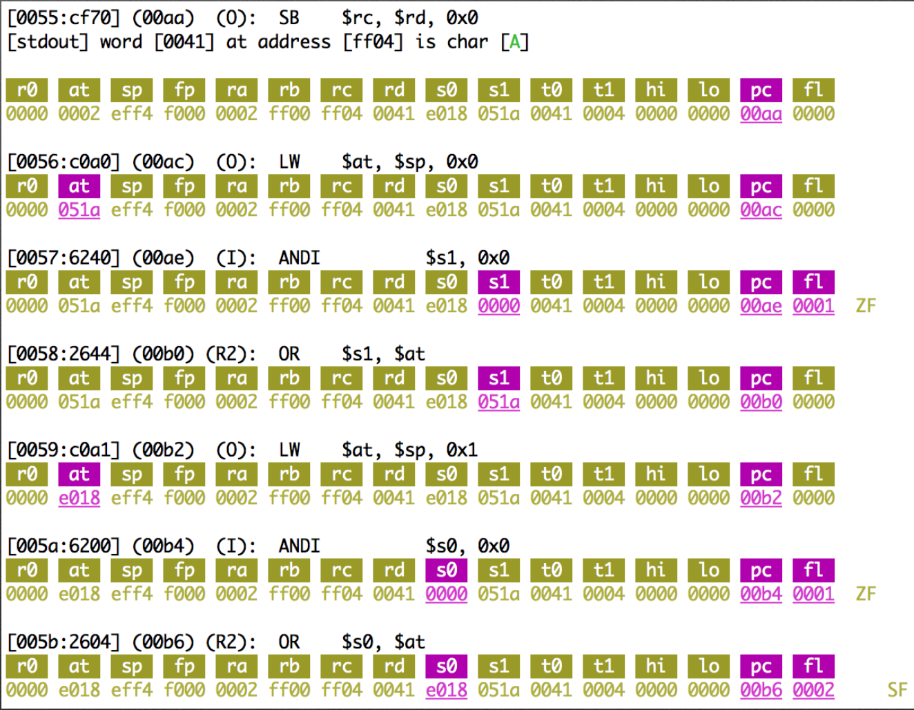

Let's design your computer
===

## Introduction

This document provides an overview of the development process from designing a computer processor to build onto a chip via programmable way. Field Programmable Gate Array ([FPGA](https://www.terasic.com.tw/cgi-bin/page/archive.pl?Language=English&CategoryNo=165&No=502)) is used to actually build a chip. The MIN16 processor is a 16-bit CPU that was built as a term project at Harvard ([CSCI E-93](http://sites.fas.harvard.edu/~cscie287/fall2017/)). In this repository, source code for MIN16 processor, sample assembly program, and useful tools are provided.

## Table of Contents
1. [Building blocks](#building-blocks)
2. [Bit format](#bit-format)
3. [Register file](#register-file)
4. [Instruction Set Architecture](#instruction-set-architecture)
5. [Datapath for instruction](#datapath-for-instruction)
6. [Assembly language](#assembly-language)
7. [Assembler](#assembler)
8. [Emulator](#emulator)
    1. [Simple mode](#simple-mode)
    2. [Display register mode](#display-register-mode)
    3. [Line-by-line execution mode](#line-by-line-execution-mode)
9. [CPU written by VHDL](#cpu-written-by-vhdl)
10. [Compile on FPGA](#compile-on-fpga)
11. [Load memory initialization file](#load-memory-initialization-file)
12. [Run your program](#run-your-program)

### Building blocks

The development process comes with these 4 building blocks and goes in this order. The first step is to determine **word size** (i.e. how many bits are bound together to carry machine instruction on a digital circuit board). Then you will design bit format to prepare a set of instructions (Assembly language: `AND`, `OR`, `ADD`, `J`, etc). Such design document serves as a reference to assembly programmers. Once assembly language is ready, you need to build an assembler to convert to machine code. Emulator is quite useful to debug your assembler programs before CPU will be working correctly. Finally, CPU is described by hardware description language and should be debugged by your assembly program. You will burn your CPU to an FPGA board, load machine code to the memory, and run the program.

| Directory | Description |
| --------- |------------ |
| doc       | Design documents and presentation materials are stored in this directory. [Instruction Set](./doc/MIN16_Instruction_Set.pdf) defines assembly language and its usage. [Datapath](./doc/MIN16_Datapath_ALL.pdf) defines digital circuit board and visualize how each instruction works on the board. |
| asm       | [Assembler](./asm/parser/parser.c) is a tool to convert an [assembly program](./asm/parser/sample3.txt) into a [machine code](./asm/parser/sample3.mif). |
| emu       | [Emulator](./emu/emulator.c) is a useful debugging tool that can simulate on your computer how assembly program should work on the MIN16 processor |
| cpu       | This directory contains all of the VHDL for the [MIN16 processor](./cpu/min16/min16.vhd), including the [ALU](./cpu/min16/alu.vhd). |

### Bit format
Once word size is determined, how do you divide those bits into parts? Typical arithmetic machine instruction contains three components, Operation Code, Destination Regiser Identifier, and Source Register Identifier.

For a general example, `ADD $r1, $r10` is an instruction to add the value of source register 10 to destination register 1. This instruction is represented in Hex digit as `0x001a`.
```markdown
[opcode] [rd] [rs]
     ADD  $r1 $r10
00000000 0001 1010

 15  14  13  12  11  10   9   8   7   6   5   4   3   2   1   0
+---------------+--------------+---------------+---------------+
|            OPCODE            |      RD       |      RS       |
|             8bits            |     4bits     |     4bits     |
+---------------+--------------+---------------+---------------+
```

### Register file
How many registers do you need? Above example uses 4bits to identify register, therefore 16 registers are available for computation. The more register number, the more temporary calculation space. But it will limit the number of operation codes. Therefore, you need to find a balance. MIN16 defined 16 registers on [Instruction Set](./doc/MIN16_Instruction_Set.pdf) page 2).

### Instruction Set Architecture
All assembly mnemonics should be defined. In addition to ALU type instructions (`ADD`, `SUB`, `AND`, `OR`, `XOR`, etc), Memory Load and Store type instructions are needed (`LW`, `SW`) so that computer can interact with external input/output device. Also, Jump and Branch instructions (`J`, `JR`, `BEQ`, `BNE`) are needed to implement conditional statement and loop. (See [Instruction Set](./doc/MIN16_Instruction_Set.pdf) page 5, 6, and 20).

### Datapath for instruction
[Datapath](./doc/MIN16_Datapath_ALL.pdf) is a blueprint of the CPU, including Memory and ALU unit that should later be described by VHDL code. It should precisely determine the size of bits sliced from instruction register and then extended, manipulated by ALU. Highlighting what information is used for the specific instruction is useful for debugging VHDL code.

An example for MIN16 ALU type instructions:


### Assembly language
Once all the assembly mnemonics are prepared, a reference document should be prepared for assembly programmer. It will describe the format, Operation, and how the instruction will be converted into the machine code. MIN16 prepared 46 assemly mnemonics (See [Instruction Set](./doc/MIN16_Instruction_Set.pdf) page 8 to 19).

An example for MIN16 ADD instruction:


### Assembler
Converting instructions assembly language into machine code is a simple task, but as a programming language it is more useful if a block of subroutine can be used by reference. Therefore, labels are usually used. Also, some C-like operators might help assembly programmers to save lines of code. These [assembler concepts](http://sites.fas.harvard.edu/~cscie287/fall2017/slides/Assembler%20Concepts.txt) are detailed in the CSCI E-93 course website.

[Sample assembly program](./asm/parser/sample3.txt) implements those functions, if written in C:
```C
void putchar(char);
int  getchar(void);
void putString(char*);
void getString(char*);
void intToString(int);
int  stringToInt(char*);
int  multiply(int a, int b);
void service(void);
```
Assembler converts into machine language, and the output format is called memory instruction file (mif) format [[Sample](./asm/parser/sample3.mif)]. Before running your processor, you will manually load the mif file into the memory in FPGA board using a software tool provided by FPGA vender. For the development of MIN16, [Quartus II Web Edition](http://dl.altera.com/13.0sp1/?edition=web) (free version) is used.

### Emulator
Emulator plays an important role before CPU is working properly. That means if your assebmly program and VHDL code both have bugs, it is difficult to debug. Therefore Emulator is a tool to make sure the assembly program is working as expected.

For the MIN16 emulator, 3 modes are preapared. Simple mode, display register mode, and line-by-line execution mode.

#### Simple mode
Executes without any debugging information.



#### Display register mode
Add debugging information such as:
- MIF Word address
- HEX machine code
- Memory Address (Program Counter)
- Addressing Modes
- Disassembled asembly code
- Register Content highliting if value changed
- Status Flag Register



#### Line-by-line execution mode
Add debugging information and executes line-by-line.

### CPU written by VHDL

### Compile on FPGA

### Load memory initialization file

### Run your program

