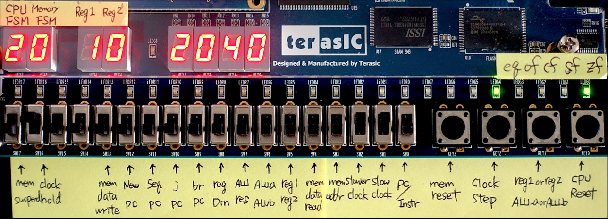

Let's design your CPU
===

### Introduction

In this guide, you will learn all you have to design a computer processor and to build onto a chip via programmable way. This guide is perfect for people who have some experience with digital logic and gates and with programming in assembler language. After learning this step-by-step guide, you'll be able to design and build your own CPU using Field Programmable Gate Array ([FPGA](ttps://www.terasic.com.tw/cgi-bin/page/archive.pl?Language=English&CategoryNo=165&No=502)).


The MIN16 processor is a 16-bit CPU that was built as a term project at Harvard ([CSCI E-93](http://sites.fas.harvard.edu/~cscie287/fall2017/)). In this repository, the source code for MIN16 processor, sample assembly program, and useful tools are provided.

### Four Steps

Design instruction set and datapath -> Make assembler -> Debug with emulator -> Build CPU

| Directory | Description |
| --------- |------------ |
| doc       | Design documents and presentation materials are stored in this directory. [Instruction Set](./doc/MIN16_Instruction_Set.pdf) defines assembly language and its usage. [Datapath](./doc/MIN16_Datapath_ALL.pdf) defines digital circuit board and visualize how each instruction works on the board. |
| asm       | [Assembler](./asm/parser/parser.c) is a tool to convert an [assembly program](./asm/parser/sample3.txt) into a [machine code](./asm/parser/sample3.mif). |
| emu       | [Emulator](./emu/emulator.c) is a useful debugging tool that can simulate on your computer how assembly program should work on the MIN16 processor |
| cpu       | This directory contains all of the VHDL for the [MIN16 processor](./cpu/min16/min16.vhd), including the [ALU](./cpu/min16/alu.vhd). |

### Demonstration
The presentation of MIN16 processor is available on [YouTube](https://youtu.be/znE2sqfCt8E).

### Books
If you are not familiar with logic design nor computer architecture, don't worry. These two books provide enough knowledge to follow this guide.
- [Contemporary Logic Design, Second Edition; Randy H. Katz and Gaetano Borriello; Prentice Hall Inc., 2005](https://www.pearson.com/us/higher-education/program/Katz-Contemporary-Logic-Design-2nd-Edition/PGM13030.html)
- [Computer Organization and Design: The Hardware/Software Interface, Fifth Edition; David A. Patterson and John L. Hennessy; Morgan Kaufmann/Elsevier, September 2013](https://www.elsevier.com/books/computer-organization-and-design/patterson/978-0-12-407726-3)


# Table of Contents
1. [Design Documents](#design-documents)
    1. [Design Bit Format](#design-bit-format)
    2. [Determine Register File](#determine-register-file)
    3. [Document Instruction Set](#document-instruction-set)
    4. [Draw Datapath for Instructions](#draw-datapath-for-instructions)
2. [Assembler](#assembler)
    1. [Detrmine Instruction Format](#detrmine-instruction-format)
    2. [Build Assembler](#build-assembler)
    3. [Write Assembly Program](#write-assembly-program)
3. [Emulator](#emulator)
4. [CPU](#cpu)
    1. [Code with VHDL](#code-with-vhdl)
    2. [Compile and Build](#compile-and-build)
    3. [Import and Write to Memory](#import-and-write-to-memory)
    4. [Run Your Program](#run-your-program)


## Design Documents

### Design Bit Format
The first step is to determine **word size** (i.e., how many bits are bound together to carry machine instruction on a digital circuit board). Once word size is determined, how do you divide those bits into parts? As shown below, a typical arithmetic instruction contains three components, **Operation Code**, **Destination Regiser**, and **Source Register**.

By using the basic example below, `ADD $r1, $r10` is expressed in hexadecimal digit as `001a`. This is an instruction to add the value of source register 10 to destination register 1. 


<!-- ```C
[opcode] [rd] [rs]
     ADD  $r1 $r10
00000000 0001 1010

 15  14  13  12  11  10   9   8   7   6   5   4   3   2   1   0
+---------------+--------------+---------------+---------------+
|            OPCODE            |      RD       |      RS       |
|             8bits            |     4bits     |     4bits     |
+---------------+--------------+---------------+---------------+
``` -->

### Determine Register File
How many registers do you need? Above example uses four bits to identify register, therefore 16 registers are available for computation. The more register number, the more temporary calculation space. But it will limit the number of operation codes. Therefore, you need to find a balance. MIN16 defined 16 registers on [Instruction Set](./doc/MIN16_Instruction_Set.pdf) page 2).

### Document Instruction Set
All assembly mnemonics should be defined. In addition to ALU type instructions (`ADD`, `SUB`, `AND`, `OR`, `XOR`, etc), Memory Load and Store type instructions are needed (`LW`, `SW`) so that computer can interact with external input/output device. Also, Jump and Branch instructions (`J`, `JR`, `BEQ`, `BNE`) are needed to implement conditional statement and loop. (See [Instruction Set](./doc/MIN16_Instruction_Set.pdf) page 5, 6, and 20).

### Draw Datapath for Instructions
[Datapath](./doc/MIN16_Datapath_ALL.pdf) is a blueprint of the CPU, including Memory and ALU unit that should later be described by VHDL code. It should precisely determine the size of bits sliced from instruction register and then extended, manipulated by ALU. Highlighting what information is used for the specific instruction is useful for debugging VHDL code.

An example for `ADD` instruction datapath (Only orange color is important):


## Assembler

### Detrmine Instruction Format
Once all the assembly mnemonics are prepared, a reference document should be prepared for assembly programmer. It will describe the **format**, the **operation**, and the **example** how the instruction will be converted into machine code. MIN16 prepared 46 assemly mnemonics (See [Instruction Set](./doc/MIN16_Instruction_Set.pdf) page 8 to 19).

An example for MIN16 ADD instruction format:


### Build Assembler
Converting instructions assembly language into machine code is a simple task, but as a programming language it is more useful if a block of subroutine can be used by reference. Therefore, labels are usually used. Also, some C-like operators might help assembly programmers to save lines of code. These [assembler concepts](http://sites.fas.harvard.edu/~cscie287/fall2017/slides/Assembler%20Concepts.txt) are detailed in the CSCI E-93 course website.

### Write Assembly Program
It is recommended to write some basic C-like functions including I/O operations. 
[Sample assembly program](./asm/parser/sample3.txt) implements the following functions, if written in C:
```C
void putchar(char);
int  getchar(void);
void putString(char*);
void getString(char*);
void intToString(int);
int  stringToInt(char*);
int  multiply(int a, int b);
```
Assembler converts assembly code into machine language, and the output format is called memory instruction file (mif) format [[Sample](./asm/parser/sample3.mif)]. Before running your processor, you will manually load the mif file into the memory in FPGA board using a software tool provided by FPGA vender. For the development of MIN16, [Quartus II Web Edition](http://dl.altera.com/13.0sp1/?edition=web) (free version) is used.

## Emulator
If both of your assembly program and VHDL code have bugs, it is difficult to debug. Emulator is a useful tool to make sure the assembly program works as expected.

For the MIN16 emulator, three modes are prepared. Simple mode, display register mode, and line-by-line execution mode.

1. Simple mode 
    - Executes without any debugging information.

2. Display register mode

    - Add debugging information such as:
        - Memory Address (Program Counter)
        - Disassembled assembly code
        - Register Content highlighting if value changed

    

3. Line-by-line execution mode
    - Add debugging information and executes line-by-line.

## CPU 

### Code with VHDL
CPU, including ALU is written by VHDL to represent [Datapath](./doc/MIN16_Datapath_ALL.pdf). In addition, you should determine the following three points:

1. Sequencing Logic
    - Control lines are determined by the sequencer ([seq.vhd](./cpu/min16/seq.vhd))
    - Branch control depends on Zero Flag
    - Load/Store control lines are chosen by the state of FSM

2. Clocking Scheme
    - Rising edge: State transitions on CPU FSM
    - Falling edge: Write Back to registers
    - Memory FSM is implemented separately ([memio.vhd](./cpu/min16/memio.vhd))

3. State transitions on Memory and CPU
    - Memory handshaking method
    - Finaite State Machine (FSM) for Memory (`MemWait`, `MemSet`, `MemReadWrite`)
    - Finaite State Machine (FSM) for CPU (See the yellow part below)

    

### Compile and Build
Once CPU is written, use [Quartus II Web Edition](http://dl.altera.com/13.0sp1/?edition=web) to compile and build on your FPGA board.

1. Compile


2. Build


### Import and Write to Memory
Last step is to import mif file and write data to In-System memory.

1. Import
    

2. Write to In-System Memory

    ***Note***: In-System memory data `6080` `22C0` `2040`... is the same as [Sample mif file](https://github.com/tanamim/MIN16/blob/66134dbe52fb1120390e9fd9deb131f4e08c2c49/asm/parser/sample3.mif#L7).
    

### Run Your Program
Now you can run your program! FPGA board comes with 7-segment LED, switches, and buttons. So you may want to set diagnostic pin assignments like [this](https://github.com/tanamim/MIN16/blob/8148a0d9e2879d7c079ccf923c0254c7d8426b94/cpu/min16/min16.vhd#L246).



# Further Development
Writing assembly program might be time-consuming. The sample assembly program shows that writing `void putchar(char)` in assembly requires about 30 lines of code. Therefore, a compiler would be another helpful tool for effective development.

# Questions?
If you have any problems or suggestions, you are welcome to create an issue on my GitHub repository. Thanks!